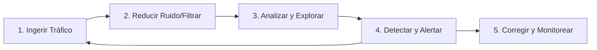

# Módulo 16 — Intro to Network Traffic Analysis

## Sección 1/15: Análisis de Tráfico de Red

## 📌 Conceptos clave
> [!NOTE]
> **¿Qué es NTA?**
> Network Traffic Analysis (NTA) = examinar el tráfico de red para caracterizar puertos/protocolos, establecer **baseline**, monitorear amenazas y maximizar visibilidad de la red.

> [!NOTE]
> **Casos de uso típicos**
> - Recolección en tiempo real para análisis de amenazas futuras
> - Establecer línea base de comunicaciones diarias
> - Detectar tráfico en puertos no estándar, hosts sospechosos, errores de protocolo
> - Detectar malware (ransomware, exploits, interacciones anómalas)
> - Investigación de incidentes pasados y **threat hunting**

> [!TIP]
> **Idea clave**
> Un atacante *siempre* debe comunicarse con la red para infiltrarse → conocer el tráfico "normal" reduce el ruido y permite detectar anomalías (ej: muchos SYN a puertos raros = posible **portscan**).

## 🧠 Conocimientos requeridos (base teórica)
- [ ] Pila TCP/IP y modelo OSI
- [ ] Conceptos de switching y routing (troncal vs switch de oficina = tráfico muy distinto)
- [ ] Puertos y protocolos comunes
- [ ] TCP (orientado a flujo, fácil de reconstruir) vs UDP (rápido, sin garantía de entrega, difícil de reconstruir)
- [ ] Encapsulación por capas (saber leer cambios de encabezado = moverse más rápido en los datos)

## 🛠️ Herramientas de captura/análisis
| Herramienta | Uso |
|---|---|
| **tcpdump** | CLI, captura/interpreta tráfico vía LibPcap (interfaz o archivo) |
| **TShark** | Versión CLI de Wireshark |
| **Wireshark** | Analizador gráfico, múltiples disectores de protocolo |
| **NGrep** | "grep para paquetes", regex/BPF, útil para depurar HTTP/FTP |
| **tcpick** | Sniffer especializado en rastrear/reensamblar flujos TCP |
| **Network Taps** | Copian tráfico físicamente (en línea o fuera de banda) |
| **Span Ports** | Espejan tráfico de capa 2/3 hacia un punto de recolección |
| **Elastic Stack** | Ingesta, visualización y búsqueda de datos |
| **SIEM (Splunk, etc.)** | Correlación, alertas, forense |

> [!WARNING]
> **BPF (Berkeley Packet Filter)**
> Sintaxis de filtrado compartida entre estas herramientas. Permite leer/escribir desde la capa de Enlace de Datos. **Se usará constantemente en el módulo** — dominar filtros BPF es clave.

## 🔄 Flujo de trabajo de NTA (no es un proceso lineal exacto)

1. **Ingerir Tráfico** → decidir ubicación de captura, usar filtros de captura si ya se sabe qué buscar
2. **Reducir Ruido (Filtrado)** → eliminar broadcast/multicast y tráfico irrelevante
3. **Analizar y Explorar** → preguntas guía:
   - ¿Tráfico cifrado o texto plano? ¿Debería estarlo?
   - ¿Usuarios accediendo a recursos indebidos?
   - ¿Hosts hablando entre sí de forma anómala?
4. **Detectar y Alertar** → identificar errores/anomalías, apoyarse en IDS/IPS (heurísticas y firmas)
5. **Corregir y Monitorear** *(fuera del loop, pero obligatorio)* → tras un fix, seguir monitoreando para confirmar resolución

> [!WARNING]
> **Requisito físico/lógico**
> Para escuchar pasivamente hay que estar conectado al **mismo segmento/VLAN**. En entornos conmutados, el tráfico no sale de su dominio de broadcast salvo con taps, span ports o port mirroring.

## 🧠 Quiz rápido (HTB Coach)

¿Cuál es la razón principal del paso "Reduce Noise by Filtering"?

**B) Facilitar el análisis eliminando tráfico irrelevante** (broadcast, multicast, etc.)

## 🔗 Relacionado
- [02-networking-primer-l1-4](02-networking-primer-l1-4.md)
- *BPF Syntax Cheatsheet*
- *Wireshark Filtros Basicos*

#cjca #modulo16 #network-traffic-analysis #nta #wireshark #tcpdump #bpf
