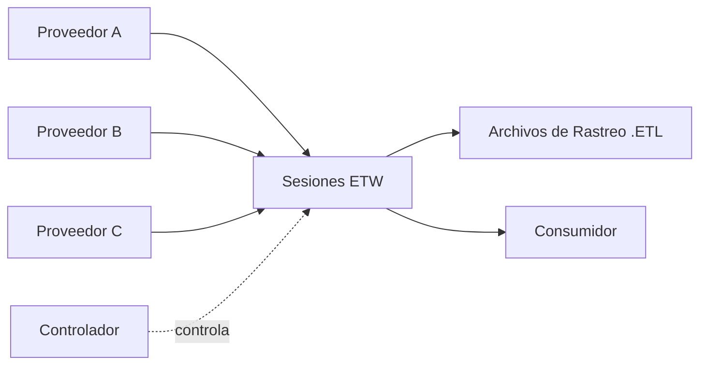

# Módulo 18 — Windows Event Logs & Finding Evil

## Sección 3/6: Rastreo de Eventos para Windows (ETW)

## 📌 ¿Qué es ETW?

> [!NOTE]
> **Definición (Microsoft)**
> **Event Tracing for Windows (ETW)** es una utilidad de rastreo de propósito general y alta velocidad, integrada en el kernel de Windows. Usa un mecanismo de buffering/logging para rastrear eventos generados por aplicaciones **user-mode** y controladores **kernel-mode**.

> [!TIP]
> **Por qué importa para el blue team**
> ETW captura muchísimo más que los logs tradicionales: system calls, creación/finalización de procesos, actividad de red, modificaciones de archivos/registro, y más — creando un "tapiz detallado" de la actividad del sistema para detectar comportamiento anómalo.

> [!NOTE]
> **Ventajas clave**
> - **Ligero**: mínimo impacto en el rendimiento del sistema
> - **Extensible**: proveedores personalizados posibles
> - Herramientas de análisis: Message Analyzer (Microsoft), `Get-WinEvent` (PowerShell)

## 🏗️ Arquitectura y componentes de ETW



### Controlador (Controller)
> [!NOTE]
> **Función**
> Gestiona todo lo relacionado con operaciones de ETW: iniciar/terminar sesiones de rastreo, habilitar/deshabilitar proveedores. Ejemplo ampliamente usado: **`logman.exe`**.

### Modelo Publicación-Suscripción: Proveedores y Consumidores

**Proveedores (4 tipos):**

| Tipo | Descripción |
|---|---|
| **MOF** | Basados en Managed Object Format — esquemas predefinidos, uso amplio |
| **WPP** (Windows Software Trace Preprocessor) | Macros/anotaciones en código fuente — rastreo/debug de bajo nivel en modo kernel |
| **Basados en manifiesto** | Archivos XML que definen estructura de eventos — más flexibles y modernos |
| **TraceLogging** | API simplificada, mínima sobrecarga de código, introducida en versiones recientes |

**Consumidores:**
> [!NOTE]
> **¿Qué hacen?**
> Se suscriben a eventos específicos y los reciben para procesamiento/análisis. Por defecto van a un archivo **.ETL**, aunque también se puede consumir vía Windows API directamente.

### Canales
> [!NOTE]
> **Función**
> Contenedores lógicos que organizan/filtran eventos según características e importancia. Los consumidores se suscriben selectivamente a canales relevantes.

### Archivos ETL
> [!TIP]
> **Almacenamiento persistente**
> Permiten análisis offline, archivado a largo plazo, e investigaciones forenses. ETW gestiona rotación de estos archivos.

> [!WARNING]
> **Notas importantes**
> - ETW soporta proveedores tanto kernel-mode como user-mode
> - Proveedores de alto volumen suelen estar **deshabilitados por defecto** (evitar sobrecarga) — se activan solo cuando una sesión los solicita explícitamente
> - **Solo los eventos de proveedores con una propiedad de canal aplicada** pueden ser consumidos por el Event Log

## 🛠️ Interactuando con ETW: Logman

> [!NOTE]
> **Logman**
> Utilidad preinstalada para gestionar ETW y Sesiones de Rastreo de Eventos: crear, iniciar, detener, investigar.

> [!WARNING]
> **El parámetro `-ets` es obligatorio**
> Sin él, Logman no identificará la Sesión de Rastreo de Eventos.

### Comandos clave

```cmd
:: Listar todas las sesiones de rastreo activas del sistema
C:\Tools> logman.exe query -ets
```
```
Data Collector Set                      Type    Status
EventLog-Security                       Trace   Running
EventLog-Microsoft-Windows-Sysmon-Operational Trace Running
SYSMON TRACE                            Trace   Running
SysmonDnsEtwSession                     Trace   Running
...
```

```cmd
:: Examinar detalles de una sesión específica (proveedores suscritos, tamaño de log, ubicación)
C:\Tools> logman.exe query "EventLog-System" -ets
```

> [!NOTE]
> **Datos clave por proveedor en una sesión**
> - **Name / Provider GUID**: identificador único del proveedor
> - **Level**: nivel del evento (Error, Warning, Informational, etc.)
> - **KeywordsAny**: filtro basado en tipo de evento generado

```cmd
:: Listar TODOS los proveedores disponibles en el sistema (Windows 10 tiene 1000+)
C:\Tools> logman.exe query providers
```

```cmd
:: Filtrar proveedores por nombre con findstr
C:\Tools> logman.exe query providers | findstr "Winlogon"
```
```
Microsoft-Windows-Winlogon               {DBE9B383-7CF3-4331-91CC-A3CB16A3B538}
Windows Winlogon Trace                   {D451642C-63A6-11D7-9720-00B0D03E0347}
```

```cmd
:: Ver detalles específicos de un proveedor: keywords, niveles, PIDs que lo usan actualmente
C:\Tools> logman.exe query providers Microsoft-Windows-Winlogon
```
```
Value               Keyword              Description
0x8000000000000000  Microsoft-Windows-Winlogon/Diagnostic
0x4000000000000000  Microsoft-Windows-Winlogon/Operational

Value               Level                Description
0x02                win:Error            Error
0x03                win:Warning          Warning
0x04                win:Informational    Information

PID                 Image
0x00001710
0x0000025c
```

## 🖥️ Alternativas GUI

> [!TIP]
> **Performance Monitor**
> Visualiza sesiones de rastreo en ejecución. Doble clic para ver detalles (proveedores, características activadas). Se pueden modificar sesiones existentes o crear nuevas ("User Defined").

> [!TIP]
> **EtwExplorer**
> Proyecto para ver metadatos de proveedores ETW (GUIDs, etc.) de forma más visual.

## 📚 Proveedores útiles para detección (cheatsheet)

| Proveedor | Utilidad para detección |
|---|---|
| **Microsoft-Windows-Kernel-Process** | Process injection, process hollowing, tácticas de malware/APT |
| **Microsoft-Windows-Kernel-File** | Acceso no autorizado a archivos, cambios en archivos críticos, exfiltración/ransomware |
| **Microsoft-Windows-Kernel-Network** | Exfiltración de datos, conexiones no autorizadas, señales de C2 |
| **Microsoft-Windows-SMBClient/SMBServer** | Patrones SMB inusuales → movimiento lateral, exfiltración |
| **Microsoft-Windows-DotNETRuntime** | Anomalías en apps .NET, explotación, carga maliciosa de ensamblados |
| **OpenSSH** | Intentos de conexión SSH, auth fallidas/exitosas, brute-force |
| **Microsoft-Windows-VPN-Client** | Conexiones VPN no autorizadas |
| **Microsoft-Windows-PowerShell** | Uso sospechoso de PowerShell, script block logging |
| **Microsoft-Windows-Kernel-Registry** | Cambios en claves de registro — persistencia, malware, config del sistema |
| **Microsoft-Windows-CodeIntegrity** | Intentos de cargar drivers/código no firmado |
| **Microsoft-Antimalware-Service** | Problemas con el servicio AV, evasión |
| **WinRM** | Gestión remota no autorizada → movimiento lateral, ejecución remota |
| **Microsoft-Windows-TerminalServices-LocalSessionManager** | Actividad de escritorio remoto no autorizada |
| **Microsoft-Windows-Security-Mitigations** | Intentos de eludir mitigaciones de seguridad existentes |
| **Microsoft-Windows-DNS-Client** | DNS tunneling, solicitudes DNS inusuales (C2) |
| **Microsoft-Antimalware-Protection** | Problemas con mecanismos AV, técnicas de evasión |

## 🔒 Proveedores Restringidos

> [!WARNING]
> **Microsoft-Windows-Threat-Intelligence**
> Proveedor de **alto valor** para DFIR — pero **restringido**: solo accesible para procesos con privilegio de **PPL (Protected Process Light)**.

> [!NOTE]
> **Requisitos para ser PPL (según Elastic)**
> El proveedor de antimalware debe:
> 1. Solicitarlo a Microsoft y demostrar su identidad
> 2. Firmar documentos legales vinculantes
> 3. Implementar un driver **ELAM** (Early Launch Antimalware)
> 4. Pasar un conjunto de pruebas de Microsoft
> 5. Obtener una firma Authenticode especial
>
> Proceso **no trivial** — pero existen workarounds para acceder a este proveedor de todas formas.

> [!TIP]
> **Valor del Threat-Intelligence provider**
> Registra datos muy granulares sobre amenazas potenciales — útil para detectar ataques sofisticados que evaden otras defensas, y sirve como evidencia forense (origen de la amenaza, sistemas afectados, alteraciones realizadas).

## 🎯 Por qué esta sección importa para lo que viene

> [!WARNING]
> **Limitaciones de Sysmon**
> La próxima sección usará ETW para investigar ataques que **evaden la detección** si solo se depende de Sysmon — debido a las limitaciones inherentes de Sysmon para capturar ciertos eventos.

## 📚 Referencias
- [A Primer on Event Tracing for Windows (ETW)](https://nasbench.medium.com/a-primer-on-event-tracing-for-windows-etw-997725c082bf)
- [A Beginner's All-Inclusive Guide to ETW](https://bmcder.com/blog/a-begginers-all-inclusive-guide-to-etw)

## 🔗 Relacionado
- [Analyzing Evil With Sysmon & Event Logs](02-analyzing-evil-sysmon-event-logs.md)
- [Tapping Into ETW](04-tapping-into-etw.md)
- *Logman Cheatsheet*
- *ETW Providers Reference*

#cjca #modulo18 #etw #logman #event-tracing #threat-intelligence #providers
