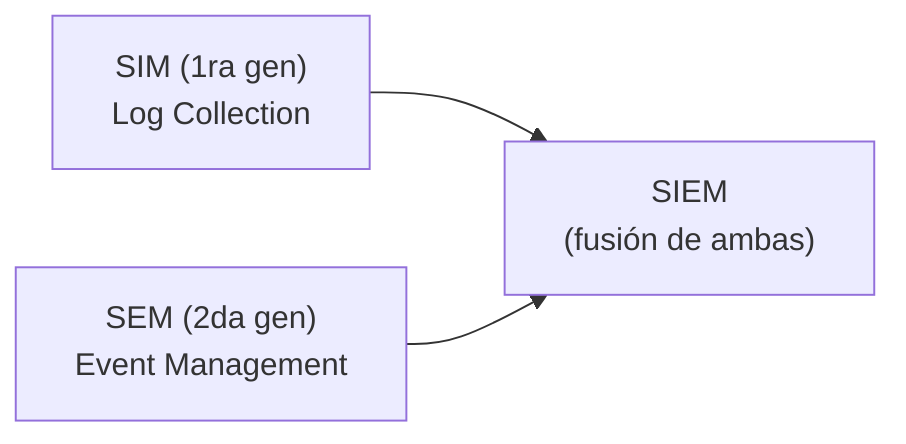
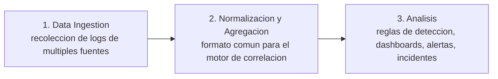

# Módulo 19 — Security Monitoring & SIEM Fundamentals

## Sección 1/11: SIEM Definition & Fundamentals

## 📌 ¿Qué es un SIEM?

> [!NOTE]
> **Definición**
> **Security Information and Event Management (SIEM)** = software que combina la **gestión de datos de seguridad** con la **supervisión de eventos de seguridad**. Permite evaluaciones **en tiempo real** de alertas generadas por hardware de red y aplicaciones.

> [!TIP]
> **Funcionalidades core de un SIEM**
> - Recolección y administración de log events
> - Análisis de logs + datos suplementarios de múltiples fuentes
> - Funciones operativas: incident handling, resúmenes visuales, documentación/reporting

> [!NOTE]
> **Valor central**
> Permite detectar ciberataques **al momento o incluso antes** de que ocurran, mejorando la velocidad de respuesta ante incidentes. Es la **base** de la estrategia de seguridad de una organización.

## 🕰️ Evolución de la tecnología SIEM

> [!NOTE]
> **Origen del término**
> Acuñado por dos analistas de Gartner en un paper de **2005** ("Enhance IT Security through Vulnerability Management"), integrando dos tecnologías previas:

| Tecnología | Generación | Enfoque |
|---|---|---|
| **SIM** (Security Information Management) | 1ra | Basada en sistemas de log collection tradicionales — almacenamiento extendido, examen, reporting, correlación con threat intelligence |
| **SEM** (Security Event Management) | 2da | Consolidación, correlación y notificación de eventos desde AV, firewalls, IDS, auth, SNMP traps, servidores, bases de datos |
| **SIEM** | Fusión | Vendors combinaron SIM + SEM → metodología integral para detectar y gestionar amenazas |

## ⚙️ ¿Cómo funciona un SIEM?

> [!NOTE]
> **Flujo general**
> Recolecta datos de PCs, dispositivos de red, servidores, etc. → estandariza y consolida esos datos → facilita el análisis por parte de especialistas en seguridad.

> [!TIP]
> **Alertas**
> Notifican al personal de SOC/Monitoring sobre un evento/incidente (posible) de seguridad. Canales: email, pop-ups de consola, SMS, llamadas telefónicas.

> [!WARNING]
> **Volumen de alertas**
> No es raro tener **cientos a miles de eventos por hora** en un solo sistema monitoreado. Por eso el **ajuste fino (tuning)** del SIEM para detectar y alertar sobre eventos de alto riesgo es crucial.

> [!NOTE]
> **SIEM vs IDS/IPS**
> SIEM **no reemplaza** las capacidades de logging de IDS/IPS — **opera junto a ellos**, procesando y amalgamando sus datos de log para reconocer eventos que podrían llevar a una explotación del sistema. La diferencia clave: la capacidad de **identificar con precisión eventos de alto riesgo** entre el ruido.

## 💼 Requisitos de negocio y casos de uso

### 1. Log Aggregation & Normalization

> [!NOTE]
> **Consolidación de logs**
> Reunir terabytes de información de seguridad de firewalls, bases de datos confidenciales, aplicaciones críticas. Permite al SOC team **examinar datos y discernir conexiones** — mejora significativa en visibilidad de amenazas.

> [!TIP]
> **Beneficio central**
> Centralizar y correlacionar información de múltiples fuentes permite reconocer **patrones, tendencias e irregularidades** que sugieren amenazas potenciales → respuesta más rápida y eficiente, reduciendo el impacto en la organización.

### 2. Threat Alerting

> [!NOTE]
> **Función esencial**
> Identificar y notificar sobre amenazas potenciales dentro del enorme volumen de datos de eventos de seguridad recolectados.

> [!TIP]
> **Cómo lo logra**
> Analítica avanzada + threat intelligence → generación de alertas en tiempo real con los detalles necesarios para investigar y mitigar el riesgo rápidamente.

### 3. Contextualization & Response

> [!WARNING]
> **El problema de generar alertas sin filtro**
> Si un SIEM alerta sobre **todo** evento posible, el equipo de IT security se satura rápidamente → aumento de falsos positivos, especialmente en soluciones más antiguas.

> [!TIP]
> **Solución: contextualización**
> Determinar: **actores involucrados**, **partes de la red afectadas**, y **el timing** del evento de seguridad. Los procesos de configuración automatizados pueden filtrar amenazas ya contextualizadas, reduciendo el número de alertas que llega al equipo.

> [!NOTE]
> **SIEM ideal**
> Permite a la empresa **gestionar amenazas directamente** — frecuentemente deteniendo operaciones mientras se investiga — minimizando el impacto potencial y protegiendo activos críticos.

### 4. Compliance

> [!NOTE]
> **Rol en el cumplimiento normativo**
> Regulaciones como **PCI DSS, HIPAA, GDPR** exigen monitoreo y análisis de tráfico de red en tiempo real. El SIEM ayuda a cumplir estos requisitos.

> [!TIP]
> **Capacidades clave para compliance**
> - Reporting y auditoría automatizados
> - Generación rápida y precisa de reportes de compliance
> - Evidencia demostrable ante auditores/reguladores

## 🔄 Flujo de datos dentro de un SIEM

> [!NOTE]
> **Paso 1 — Data Ingestion**
> Cada herramienta SIEM tiene capacidades únicas para recolectar logs de distintas fuentes.

> [!NOTE]
> **Paso 2 — Normalización y Agregación**
> Los datos crudos deben convertirse a un **formato común** que el motor de correlación del SIEM pueda entender, sin importar de qué tipo de dataset provienen originalmente.

> [!NOTE]
> **Paso 3 — Análisis (la parte más crítica)**
> El SOC team usa los datos normalizados para crear: reglas de detección, dashboards, visualizaciones, alertas e incidentes → identificación de riesgos + respuesta rápida.

## ✅ Beneficios de usar un SIEM

> [!WARNING]
> **Sin SIEM**
> No hay vista centralizada de logs/eventos → se pueden pasar por alto eventos cruciales, y se acumula una gran cantidad de eventos pendientes de investigación.

> [!TIP]
> **Ejemplo práctico del módulo**
> - Firewall registra **5 intentos de login fallidos consecutivos** → cuenta admin bloqueada → se necesita un sistema centralizado que correlacione todos los logs para monitorear la situación
> - Software de web filtering registra una PC conectándose a un sitio malicioso **100 veces en una hora** → visible y accionable desde una sola interfaz con SIEM

> [!NOTE]
> **SIEMs modernos**
> Incluyen inteligencia integrada para detectar **límites de umbral configurables** y eventos dentro de marcos de tiempo específicos, además de resúmenes y reportes personalizables. Los más sofisticados integran **IA** para alertar basándose en análisis de comportamiento y patrones.

> [!TIP]
> **Impacto financiero**
> Detectar ataques maliciosos **antes de que ocurran** reduce los costos asociados a una brecha de seguridad a gran escala — evitando daño financiero y reputacional significativo.

> [!WARNING]
> **Requisito regulatorio en industrias específicas**
> Organizaciones en **Banking, Finance, Insurance, Healthcare** suelen estar obligadas a tener un SIEM gestionado (on-premise o cloud) — como evidencia de monitoreo, revisión de logs, y cumplimiento de políticas de retención (ISO, HIPAA, etc.)

## 🔗 Relacionado
- [Introduction To The Elastic Stack](02-introduccion-elastic-stack.md)
- [Modulo 17 - Incident Handling](../02-incident-handling-process/01-incident-handling.md)
- [Modulo 18 - Windows Event Logs](../03-windows-event-logs/01-windows-event-logs.md)

#cjca #modulo19 #siem #sim #sem #log-aggregation #threat-alerting #compliance #soc
