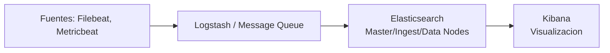

# Módulo 19 — Security Monitoring & SIEM Fundamentals

## Sección 2/11: Introducción al Elastic Stack

## 📌 ¿Qué es el Elastic Stack?

> [!NOTE]
> **Definición**
> Colección open-source creada por Elastic, compuesta principalmente de **tres aplicaciones** que trabajan en conjunto: **Elasticsearch, Logstash y Kibana**. Ofrece búsqueda y visualización integral para análisis y exploración de logs en tiempo real.

> [!TIP]
> **Escalabilidad en entornos exigentes**
> La arquitectura de alto nivel puede reforzarse con **Kafka, RabbitMQ, Redis** (buffering y resiliencia) y **nginx** (seguridad).

## 🧩 Componentes del stack



### Elasticsearch
> [!NOTE]
> **¿Qué hace?**
> Motor de búsqueda **distribuido y basado en JSON**, con APIs RESTful. Componente **core** del stack: indexa, almacena y consulta datos. Permite queries sofisticadas y análisis sobre los registros procesados por Logstash.

### Logstash
> [!NOTE]
> **¿Qué hace?**
> Responsable de **recolectar, transformar y transportar** registros de log. Su fortaleza: consolidar datos de múltiples fuentes y normalizarlos.

**3 áreas principales de operación:**

| Fase | Descripción |
|---|---|
| **1. Process input** | Ingiere logs de ubicaciones remotas, convirtiéndolos a formato legible por máquina (input: archivo plano, socket TCP, syslog, etc.) |
| **2. Transform & enrich** | Filter plugins modifican formato/contenido del registro, a menudo según condiciones predefinidas |
| **3. Send to Elasticsearch** | Output plugins transmiten los registros ya transformados |

### Kibana
> [!NOTE]
> **¿Qué hace?**
> Herramienta de **visualización** para documentos de Elasticsearch. Permite ver datos y ejecutar queries, simplificando la comprensión de resultados con tablas, gráficos y dashboards personalizados.

### Beats
> [!TIP]
> **Componente adicional**
> Data shippers **ligeros y de propósito único**, instalados en máquinas remotas para reenviar logs/métricas directamente a Logstash o Elasticsearch. Simplifican la recolección de datos de múltiples fuentes.

**Dos arquitecturas posibles:**
```
Beats → Logstash → Elasticsearch → Kibana   (con colas persistentes)
Beats → Elasticsearch → Kibana               (mas simple, nodos uniformes)
```

## 🛡️ El Elastic Stack como solución SIEM

> [!NOTE]
> **Implementación como SIEM**
> Datos de seguridad (firewalls, IDS/IPS, endpoints) se ingieren vía **Logstash** → **Elasticsearch** almacena/indexa → **Kibana** crea dashboards/visualizaciones para insights de seguridad.

> [!TIP]
> **Rol del analista SOC**
> **Kibana** será la interfaz principal de trabajo — dominar sus funcionalidades es esencial.

## 🔍 Kibana Query Language (KQL)

> [!NOTE]
> **¿Qué es KQL?**
> Lenguaje de consulta diseñado específicamente para buscar/analizar datos en Kibana — más intuitivo que el Query DSL de Elasticsearch.

### Estructura básica: field:value

```
event.code:4625
```
> [!TIP]
> **Qué hace esta query**
> Filtra eventos con el **código de evento Windows 4625** — asociado a **intentos de login fallidos**. Permite identificar brute-force, password guessing y otras actividades sospechosas de login.

### Free Text Search

```
"svc-sql1"
```
> [!NOTE]
> **Búsqueda sin especificar campo**
> Retorna registros que contengan ese string en **cualquier** campo indexado.

### Operadores lógicos (AND, OR, NOT)

```
event.code:4625 AND winlog.event_data.SubStatus:0xC0000072
```
> [!WARNING]
> **Significado de SubStatus 0xC0000072**
> Indica que la cuenta está **actualmente deshabilitada**. Ver intentos de login fallidos contra una cuenta deshabilitada requiere investigación — las credenciales podrían haber sido descubiertas por un atacante.

### Operadores de comparación (`:`, `:>`, `:>=`, `:<`, `:<=`, `:!`)

```
event.code:4625 AND winlog.event_data.SubStatus:0xC0000072 AND @timestamp >= "2023-03-03T00:00:00.000Z" AND @timestamp <= "2023-03-06T23:59:59.999Z"
```
> [!TIP]
> **Uso**
> Permite acotar por **rango temporal** — en este caso, login fallidos contra cuentas deshabilitadas entre el 3 y 6 de marzo de 2023.

### Wildcards y expresiones regulares

```
event.code:4625 AND user.name: admin*
```
> [!TIP]
> **Qué hace**
> Filtra logins fallidos donde el username **empieza con "admin"** (admin, administrator, admin123, etc.) — útil para detectar intentos dirigidos a cuentas administrativas.

## 🔎 Cómo identificar campos y valores disponibles

### Enfoque 1: Free text search + Discover

> [!NOTE]
> **Metodología práctica**
> 1. Buscar el Event ID en un recurso externo (ej: [ultimatewindowssecurity.com](https://www.ultimatewindowssecurity.com/securitylog/encyclopedia/event.aspx?eventid=4625)) para entender su significado
> 2. Usar free text search en Kibana Discover con solo el número (ej: `"4625"`)
> 3. Observar qué campos aparecen en los resultados: `event.code`, `winlog.event_id`, `@timestamp`

> [!TIP]
> **Diferencia entre campos equivalentes**
> - `event.code` → pertenece al **Elastic Common Schema (ECS)**
> - `winlog.event_id` → pertenece específicamente a **Winlogbeat**
> - Si la organización usa Elastic Stack en todas las oficinas/departamentos, **preferir campos ECS** (razones más abajo)
> - `@timestamp` contiene el tiempo extraído del evento original — **distinto** de `event.created`

### Enfoque 2: Documentación de Elastic

> [!TIP]
> **Recursos recomendados**
> - Elastic Common Schema (ECS)
> - ECS event fields
> - Winlogbeat fields / Winlogbeat ECS fields / Winlogbeat security module fields
> - Filebeat fields / Filebeat ECS fields

## 📐 Elastic Common Schema (ECS)

> [!NOTE]
> **¿Qué es?**
> Vocabulario **compartido y extensible** para eventos/logs en todo el Elastic Stack — asegura formatos de campo consistentes entre distintas fuentes de datos.

### Ventajas de usar campos ECS en KQL

| Ventaja | Por qué importa |
|---|---|
| **Vista unificada de datos** | Windows logs, tráfico de red, eventos de endpoint, cloud → todos buscables con los mismos nombres de campo |
| **Eficiencia de búsqueda** | No hace falta memorizar nombres de campo específicos por fuente de datos |
| **Correlación mejorada** | Correlacionar una IP entre logs de red, firewall y endpoint fácilmente |
| **Mejores visualizaciones** | Nomenclatura consistente → dashboards más intuitivos |
| **Interoperabilidad** | Compatibilidad total con Elastic Security, Observability, Machine Learning |
| **Future-proofing** | ECS es el esquema fundacional del stack — garantiza compatibilidad con futuras funciones |

## 🖥️ Ejercicio práctico

> [!WARNING]
> **Tiempo de espera**
> Esperar 3-5 minutos tras spawnear el target para que Kibana esté disponible.

**Acceso:**
```
http://[Target IP]:5601
```

**Pasos:**
1. Toggle de navegación lateral → **Discover**
2. Ícono de calendario → especificar **"last 15 years"** → Apply
3. Elegir index pattern **"windows*"**
4. Ejecutar la query de la sección "Comparison Operators" → identificar el username de la cuenta deshabilitada
5. Ejecutar la query de "Wildcards and Regular Expressions" → contar resultados (hits)

> [!WARNING]
> No se incluye el username específico ni el número de hits — son datos del entorno propio del lab. La metodología completa (queries exactas + pasos de navegación) está documentada arriba.

## 🔗 Relacionado
- [SIEM Definition & Fundamentals](01-siem-definition-fundamentals.md)
- [SOC Definition & Fundamentals](03-soc-definition-fundamentals.md)

#cjca #modulo19 #elastic-stack #elasticsearch #logstash #kibana #kql #ecs #beats
