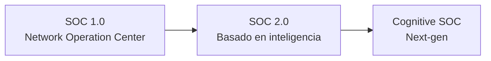

# Módulo 19 — Security Monitoring & SIEM Fundamentals

## Sección 3/11: SOC Definition & Fundamentals

## 📌 ¿Qué es un SOC?

> [!NOTE]
> **Definición**
> **Security Operations Center (SOC)** — instalación que aloja un equipo de expertos en seguridad de la información, responsables de **monitorear y evaluar continuamente** el estado de seguridad de una organización.

> [!TIP]
> **Objetivo principal**
> **Identificar, examinar y abordar** incidentes de ciberseguridad combinando soluciones tecnológicas con procedimientos bien definidos.

> [!NOTE]
> **Composición del equipo**
> Analistas de seguridad, ingenieros y managers que colaboran estrechamente con los equipos de incident response.

### Herramientas tecnológicas del SOC

| Herramienta | Función |
|---|---|
| **SIEM** | Monitoreo/identificación de amenazas |
| **IDS/IPS** | Detección/prevención de intrusiones |
| **EDR** | Detección y respuesta en endpoints |
| **Threat Intelligence** | Alimenta iniciativas de threat hunting proactivo |

> [!NOTE]
> **Procesos definidos**
> El SOC sigue procesos claros: **triage de incidentes, contención, eliminación y recuperación** — en cooperación estrecha con el equipo de IR.

## ⚙️ ¿Cómo funciona un SOC?

> [!WARNING]
> **Enfoque operativo, no estratégico**
> La función primaria del SOC es gestionar el aspecto **operativo continuo** de la seguridad empresarial — **no** se enfoca en desarrollar estrategias de seguridad, diseñar arquitectura, o implementar medidas protectoras (eso corresponde a otros equipos).

> [!TIP]
> **Capacidades avanzadas opcionales**
> Algunos SOCs poseen **forensic analysis** y **malware analysis** — permiten investigaciones profundas y examinar la causa raíz para prevenir ataques futuros.

## 👥 Roles dentro de un SOC

| Rol | Responsabilidad |
|---|---|
| **SOC Director** | Gestión general y planificación estratégica: presupuesto, staffing, alineación con objetivos organizacionales |
| **SOC Manager** | Operaciones diarias, gestión del equipo, coordinación de IR, colaboración con otros departamentos |
| **Tier 1 Analyst** | Monitorea alertas/eventos, hace triage inicial, escala a tiers superiores |
| **Tier 2 Analyst** | Análisis profundo de incidentes escalados, identifica patrones, desarrolla estrategias de mitigación |
| **Tier 3 Analyst** | Expertise avanzada en incidentes complejos, threat hunting, colabora para mejorar postura de seguridad |
| **Detection Engineer** | Desarrolla/mantiene reglas de detección y firmas para SIEM/IDS/IPS/EDR; identifica gaps de cobertura |
| **Incident Responder** | Maneja incidentes activos: forense digital, contención, remediación, restauración de sistemas |
| **Threat Intelligence Analyst** | Recolecta/analiza/disemina inteligencia de amenazas para defensa proactiva |
| **Security Engineer** | Desarrolla/despliega/mantiene herramientas y tecnologías de seguridad |
| **Compliance and Governance Specialist** | Asegura adherencia a estándares/regulaciones/mejores prácticas; asiste con auditorías |
| **Security Awareness and Training Coordinator** | Desarrolla programas de entrenamiento y concientización en seguridad |

> [!NOTE]
> **Los roles varían**
> La estructura específica depende del tamaño de la organización, la industria, y los requisitos de seguridad particulares.

### Estructura por Tiers (resumen)

> [!TIP]
> **Tier 1 — "First Responders"**
> Monitorean eventos/alertas, hacen triage inicial, escalan. Objetivo: **identificar y priorizar** rápidamente.

> [!TIP]
> **Tier 2 — Analistas más experimentados**
> Análisis más profundo de incidentes escalados, identifican patrones/tendencias, desarrollan mitigaciones. A veces **ajustan (tune)** herramientas de monitoreo para reducir falsos positivos.

> [!TIP]
> **Tier 3 — Los más experimentados/conocedores**
> Manejan incidentes complejos y de alto perfil. Realizan **threat hunting proactivo**, desarrollan estrategias avanzadas de detección/prevención.

## 📈 Etapas de evolución del SOC

### SOC 1.0
> [!WARNING]
> **Enfoque original — reactivo**
> Inversión en capas de seguridad aisladas (plataformas de intel, gestión de identidad) **sin integración adecuada** → alertas no correlacionadas y acumulación de tareas entre múltiples plataformas.

> [!NOTE]
> **Foco**
> Seguridad de red y perímetro — incluso cuando las amenazas ya explotaban otros vectores.

> [!WARNING]
> **Aún vigente en algunas organizaciones**
> Sorprendentemente, algunas organizaciones siguen dependiendo de este enfoque obsoleto — "esperando" a que ocurra una brecha grave.

### SOC 2.0
> [!NOTE]
> **Impulsado por amenazas sofisticadas**
> Ataques multi-vector, persistentes, asíncronos, con IOCs ocultos. Malware (incluyendo variantes móviles) y **botnets** como métodos primarios de entrega.

> [!TIP]
> **Basado en inteligencia (intelligence-driven)**
> Integra: **security telemetry, threat intelligence, network flow analysis**, y otras técnicas de detección de anomalías. Incluye análisis de **capa 7** para detectar ataques "low and slow" y amenazas ocultas.

> [!NOTE]
> **Componentes clave de SOC 2.0**
> - **Situational awareness** completa
> - Preparación **pre-evento**: vulnerability management, configuration management, dynamic risk management
> - Análisis **post-evento**: incident response + forense en profundidad
> - Refinamiento continuo de reglas de intel y despliegue de contramedidas
> - Colaboración entre SOCs (a nivel sectorial o nacional) — enfoque de investigación de amenazas orientado hacia adelante

### Cognitive SOC (Next-gen)
> [!WARNING]
> **Limitaciones remanentes de SOC 2.0**
> Aunque SOC 2.0 tiene todos los subsistemas esenciales, suele carecer de:
> - **Experiencia operativa**
> - Colaboración efectiva entre negocio y equipos de seguridad para crear reglas específicas al proceso/sistema de negocio
> - Procedimientos **estandarizados** de IR y recuperación

> [!TIP]
> **Solución propuesta**
> Incorporar **sistemas de aprendizaje (learning systems)** que compensen los gaps de experiencia en la toma de decisiones de seguridad. La tasa de éxito no es perfecta en todos los casos, pero se espera que **mejore con el tiempo**.

📚 Referencia: [The Evolution of Security Operations Center 2.0 & Beyond](https://www.linkedin.com/pulse/evolution-security-operations-center-20-beyond-krishnan-jagannathan/)

## 🧠 Quiz de repaso

¿Verdadero o Falso? SOC 2.0 sigue un enfoque de defensa proactivo.

**Verdadero** — SOC 2.0 es intelligence-driven, con énfasis en preparación pre-evento (vulnerability/configuration/risk management), análisis de comportamiento de amenazas, y colaboración proactiva entre SOCs, a diferencia del enfoque reactivo de SOC 1.0.

## 🔗 Relacionado
- [Introduction To The Elastic Stack](02-introduccion-elastic-stack.md)
- [MITRE ATT&CK & Security Operations](04-mitre-attack-security-operations.md)
- [Modulo 17 - Incident Handling](../02-incident-handling-process/01-incident-handling.md)

#cjca #modulo19 #soc #soc-roles #soc-evolution #tier1 #tier2 #tier3 #cognitive-soc
