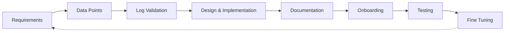

# Módulo 19 — Security Monitoring & SIEM Fundamentals

## Sección 5/11: SIEM Use Case Development

## 📌 ¿Qué es un SIEM Use Case?

> [!NOTE]
> **Definición**
> Ilustra una **situación específica** donde el SIEM puede aplicarse para identificar/detectar incidentes de seguridad potenciales. Puede ir desde escenarios simples (login fallido) hasta complejos (detección de brote de ransomware).

> [!TIP]
> **Ejemplo del módulo: caso "brute force"**
> Un usuario "Rob" tiene **10 intentos de autenticación fallidos consecutivos**. Puede ser el usuario real olvidando su password, o un atacante intentando fuerza bruta. En ambos casos, el SIEM **correlaciona** los 10 eventos en uno solo → dispara alerta al SOC bajo la categoría "brute force".

## 🔄 Ciclo de vida del desarrollo de Use Cases

| Etapa | Descripción |
|---|---|
| **Requirements** | Comprender el propósito/necesidad del use case — puede venir de clientes, analistas, o empleados. Ej: alertar tras 10 fallos de login consecutivos en 4 minutos |
| **Data Points** | Identificar todos los puntos de la red donde una cuenta puede loguearse. Recolectar fuentes de log (Windows, Linux, endpoints, servidores, apps). Asegurar campos esenciales: user, timestamp, source, destination |
| **Log Validation** | Verificar que los logs contengan toda la info crítica, para todos los tipos de autenticación (local, web, app, VPN, OWA) |
| **Design & Implementation** | Definir condiciones de disparo considerando 3 parámetros: **Condition, Aggregation, Priority** |
| **Documentation** | Crear **SOP** (Standard Operating Procedures) — condiciones, agregaciones, prioridades, a quién reportar, matriz de escalación |
| **Onboarding** | Empezar en desarrollo antes de pasar a producción; identificar/corregir gaps para reducir falsos positivos |
| **Periodic Update/Fine-tuning** | Feedback regular de analistas + whitelisting continuo — mantener reglas de correlación actualizadas |

## 🛠️ Cómo construir SIEM Use Cases (checklist)

> [!NOTE]
> **Pasos recomendados**
1. Comprender necesidades/riesgos → establecer alertas para monitorear los sistemas necesarios
2. Determinar prioridad e impacto → mapear la alerta a la kill chain o MITRE
3. Establecer **TTD** (Time to Detection) y **TTR** (Time to Response) → medir efectividad del SIEM y performance de analistas
4. Crear SOP para gestionar alertas
5. Definir proceso de refinamiento de alertas basado en monitoreo del SIEM
6. Desarrollar **IRP** (Incident Response Plan) para incidentes true positive
7. Establecer **SLAs** y **OLAs** entre equipos
8. Implementar proceso de auditoría para gestión de alertas/reporting
9. Documentar estado de logging de máquinas/sistemas, base de creación de alertas, frecuencia de disparo
10. Establecer una base de conocimiento (knowledge base) actualizada

## 🎯 Ejemplo 1: MSBuild iniciado por una aplicación de Office (HIGH severity)

> [!NOTE]
> **Contexto: ¿Qué es MSBuild?**
> Parte del Microsoft Build Engine — sistema de compilación que ensambla aplicaciones según un archivo XML de entrada. Normalmente generado por Visual Studio, pero también usable sin él.

> [!WARNING]
> **Vector de ataque: LoLBins (Living-off-the-Land Binaries)**
> Los atacantes explotan la capacidad de MSBuild de incluir **código fuente malicioso** en su archivo de configuración/proyecto. Al ejecutarse desde un binario legítimo del sistema, evade muchas detecciones tradicionales.

### Definir el riesgo y el objetivo de monitoreo

> [!WARNING]
> **Comportamiento sospechoso a vigilar**
> Un navegador web o ejecutable de **Microsoft Office iniciando MSBuild** → comportamiento altamente anómalo, sugiere posible payload malicioso vía script.

> [!TIP]
> **Por qué esto funciona bien como detección**
> Una vez establecido el baseline, las llamadas inusuales a MSBuild son **fáciles de identificar y relativamente raras** — no genera carga de trabajo excesiva para el equipo.

### Prioridad, impacto y mapeo MITRE

> [!WARNING]
> **Severidad: HIGH**
> LoLBins representa un riesgo global significativo si es detectado — aunque la severidad puede variar según el contexto/panorama específico de cada organización.

| Tactic | Technique | Sub-technique |
|---|---|---|
| **Defense Evasion** (`TA0005`) | Trusted Developer Utilities Proxy Execution (`T1127`) | MSBuild (`T1127.001`) |
| **Execution** (`TA0002`) | — (ejecutar el binario MSBuild en el endpoint también cae bajo esta táctica) | — |

### TTD y TTR

> [!NOTE]
> **Configuración de ejemplo**
> Regla configurada para ejecutarse **cada 5 minutos**, monitoreando todos los logs entrantes.

### Campos clave para el SOP

> [!TIP]
> **Información a documentar/recolectar**
- `process.name`
- `process.parent.name`
- `event.action`
- Máquina donde se detectó la alerta
- Usuario asociado a la máquina
- Actividad del usuario en **±2 días** de la generación de la alerta

> [!NOTE]
> **Acción del defensor**
> Contactar al usuario + examinar su máquina (logs de sistema, AV, proxy desde el SIEM) para visibilidad completa.

### Fine-tuning de la regla

> [!TIP]
> **Reducir falsos positivos**
> Build Engine es común entre **desarrolladores Windows** — pero su uso por no-ingenieros es inusual. **Excluir nombres de proceso padre legítimos** de la regla ayuda a evitar falsos positivos.

## 🎯 Ejemplo 2: MSBuild haciendo conexiones de red (MEDIUM severity)

> [!NOTE]
> **Escenario**
> Una máquina intenta comunicación **saliente** con una IP remota/potencialmente maliciosa, y el proceso detrás de esa conexión es `MsBuild.exe`.

> [!WARNING]
> **Por qué es MEDIUM y no HIGH**
> A diferencia del Ejemplo 1, esta situación puede ocurrir **legítimamente** (ej: MsBuild conectando a una IP de Microsoft para updates). Sin un proceso robusto de threat intelligence, esto genera **más falsos positivos** → severidad MEDIUM en vez de HIGH.

### Mapeo MITRE

| Tactic | Nota |
|---|---|
| **Execution** (`TA0002`) | Ejecutar el binario MsBuild en el endpoint sigue siendo requisito para este ataque |

> [!TIP]
> **Diferencias en el SOP respecto al Ejemplo 1**
> El foco cambia hacia: `event.action`, **dirección IP**, y **reputación de la IP** (entre otros factores) — en vez de enfocarse solo en el proceso padre.

## 🧠 Comparación de los dos ejemplos

| Aspecto | Ejemplo 1 (MSBuild por Office) | Ejemplo 2 (MSBuild → red) |
|---|---|---|
| **Severidad** | HIGH | MEDIUM |
| **Por qué** | Comportamiento muy raro, casi siempre malicioso | Puede ser legítimo (updates de MS), más ruido |
| **MITRE Tactics** | Defense Evasion + Execution | Execution |
| **Foco del SOP** | process.name, process.parent.name, actividad de usuario | event.action, IP, reputación de IP |
| **Fine-tuning** | Excluir procesos padre legítimos | Requiere threat intelligence robusta sobre IPs |

## 🔗 Relacionado
- [MITRE ATT&CK & Security Operations](04-mitre-attack-security-operations.md)
- [SIEM Visualization Example 1](06-siem-visualization-example-1-all-users.md)

#cjca #modulo19 #siem-use-case #ttd #ttr #msbuild #lolbins #mitre-mapping #fine-tuning
