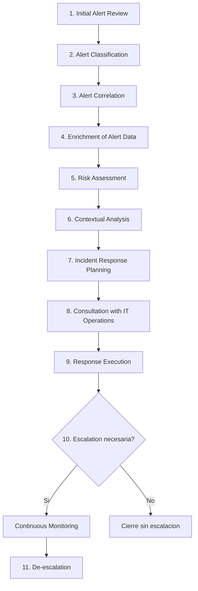

# Módulo 19 — Security Monitoring & SIEM Fundamentals

## Sección 10/11: The Triaging Process

## 📌 ¿Qué es Alert Triaging?

> [!NOTE]
> **Definición**
> Proceso realizado por un analista SOC para **evaluar y priorizar** alertas de seguridad generadas por sistemas de monitoreo/detección, determinando su nivel de amenaza e impacto potencial. Implica revisar y categorizar sistemáticamente para **asignar recursos efectivamente**.

## 📢 Escalación

> [!NOTE]
> **¿Qué implica?**
> Notificar a supervisores, equipos de IR, o personas designadas con **autoridad para decidir** y coordinar la respuesta. El analista SOC provee: severidad, impacto potencial, y hallazgos de la investigación inicial.

> [!TIP]
> **Por qué importa**
> Asegura que las alertas críticas reciban **atención pronta**, facilita coordinación entre stakeholders, y aprovecha la expertise de quienes gestionan amenazas de mayor nivel.

## 🔄 El proceso ideal de Triaging (11 etapas)

### 1️⃣ Initial Alert Review
> [!NOTE]
> **Qué revisar**
> Metadata, timestamp, IP origen/destino, sistemas afectados, regla/firma disparadora. Analizar logs asociados (red, sistema, aplicación) para entender el **contexto**.

### 2️⃣ Alert Classification
> [!NOTE]
> **Clasificar por**
> Severidad, impacto, urgencia — según el sistema de clasificación predefinido de la organización.

### 3️⃣ Alert Correlation
> [!TIP]
> **Buscar patrones**
> - Cruzar con alertas/eventos/incidentes relacionados → identificar IOCs
> - Consultar el SIEM/log management para más datos relevantes
> - Usar feeds de threat intelligence para verificar patrones de ataque conocidos o firmas de malware

### 4️⃣ Enrichment of Alert Data
> [!TIP]
> **Recolectar contexto adicional**
> - Capturas de paquetes de red, memory dumps, muestras de archivos
> - Fuentes externas de threat intel, herramientas open-source, sandboxes (analizar archivos/URLs/IPs sospechosas)
> - Reconocimiento de sistemas afectados: conexiones de red, procesos, modificaciones de archivos

### 5️⃣ Risk Assessment
> [!WARNING]
> **Evaluar impacto potencial**
> - Valor de sistemas afectados, sensibilidad de datos, requisitos de compliance, implicaciones regulatorias
> - Probabilidad de éxito del ataque o de **movimiento lateral**

### 6️⃣ Contextual Analysis
> [!NOTE]
> **Consideraciones del analista**
> - Activos afectados, su criticidad, sensibilidad de datos que manejan
> - Controles de seguridad existentes (firewalls, IDS/IPS, EPP) → ¿la alerta indica falla de control o técnica de evasión?
> - Requisitos de compliance, regulaciones de industria, obligaciones contractuales

### 7️⃣ Incident Response Planning
> [!NOTE]
> **Si la alerta es significativa**
> - Documentar: detalles de la alerta, sistemas afectados, comportamientos observados, IOCs potenciales, datos de enrichment
> - Asignar miembros del equipo IR con roles/responsabilidades definidas
> - Coordinar con otros equipos (network ops, sysadmins, vendors)

### 8️⃣ Consultation with IT Operations
> [!TIP]
> **Evaluar contexto faltante**
> - Consultar con IT ops sobre cambios recientes, mantenimiento en curso
> - Entender issues conocidos, misconfiguraciones, o cambios de red que pudieran generar **falsos positivos**
> - Documentar los insights obtenidos

### 9️⃣ Response Execution
> [!NOTE]
> **Decisión basada en lo anterior**
> - Si el contexto adicional resuelve la alerta o la identifica como **no maliciosa** → actuar sin escalación
> - Si aún indica preocupación de seguridad → proceder con acciones de IR

### 🔟 Escalation
> [!WARNING]
> **Triggers de escalación**
> - Compromiso de sistemas/activos críticos
> - Ataques en curso
> - Técnicas desconocidas/sofisticadas
> - Impacto extendido
> - Amenazas internas (insider threats)

> [!NOTE]
> **Al escalar**
> - Seguir el proceso interno de escalación → notificar equipos/management de nivel superior
> - Proveer: resumen completo de la alerta, severidad, impacto potencial, datos de enrichment, risk assessment
> - Documentar toda comunicación relacionada
> - En algunos casos, escalar a entidades externas (law enforcement, proveedores de IR, CERTs) según requisitos legales/regulatorios

### Continuous Monitoring
> [!TIP]
> **Durante la respuesta activa**
> Monitorear continuamente el progreso del IR, mantener comunicación abierta con equipos escalados, colaborar de cerca para respuesta coordinada.

### 1️⃣1️⃣ De-escalation
> [!NOTE]
> **Cuándo des-escalar**
> Cuando el riesgo está mitigado, el incidente contenido, y no se requiere escalación adicional.

> [!TIP]
> **Al des-escalar**
> Notificar a las partes relevantes con: resumen de acciones tomadas, resultados, y **lecciones aprendidas**.

> [!WARNING]
> **Mejora continua**
> Revisar y actualizar regularmente el proceso, alineándolo con políticas/procedimientos organizacionales, adaptándolo a amenazas emergentes y necesidades evolutivas.

## 🧠 Resumen visual del ciclo completo

| Fase | Pregunta clave que responde |
|---|---|
| Initial Review | ¿Qué pasó exactamente? |
| Classification | ¿Qué tan grave/urgente es? |
| Correlation | ¿Está relacionado con algo más? |
| Enrichment | ¿Qué contexto adicional tengo? |
| Risk Assessment | ¿Cuánto impacto potencial hay? |
| Contextual Analysis | ¿Qué activos/compliance están en juego? |
| IR Planning | ¿Quién hace qué si esto escala? |
| IT Ops Consultation | ¿Es esto realmente malicioso o es ruido/mantenimiento? |
| Response Execution | ¿Actúo ahora o cierro como benigno? |
| Escalation | ¿Necesito subir esto de nivel? |
| De-escalation | ¿Ya está controlado? |

## 🔗 Relacionado
- [SIEM Visualization Example 4: Group Membership Changes](09-siem-visualization-example-4-group-membership-changes.md)
- [Skills Assessment](11-skills-assessment.md)
- [Modulo 17 - Incident Handling](../02-incident-handling-process/01-incident-handling.md)

#cjca #modulo19 #alert-triaging #escalation #ioc #risk-assessment #incident-response #soc-analyst
