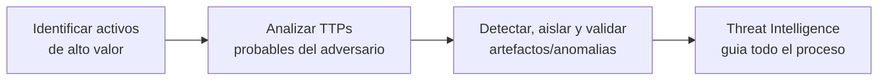

# Módulo 20 — Introduction to Threat Hunting & Hunting With Elastic

## Sección 1/6: Threat Hunting Fundamentals

## 📌 Definición de Threat Hunting

> [!NOTE]
> **El problema del "dwell time"**
> La duración mediana entre una brecha real y su detección ("dwell time") suele ser de **varias semanas, si no meses** — implicando presencia adversaria potencial en la red por casi **3 semanas**, un periodo con impacto significativo.

> [!WARNING]
> **Por qué esto importa**
> Este dato subraya la creciente **ineficacia de las tácticas defensivas tradicionales** — de ahí la necesidad de un cambio de paradigma hacia una estrategia proactiva/ofensiva: el **threat hunting**.

> [!NOTE]
> **Definición**
> Práctica **activa, liderada por humanos**, a menudo **hypothesis-driven**, que examina sistemáticamente datos de red para identificar amenazas sigilosas y avanzadas que **evaden las soluciones de seguridad existentes**.

> [!TIP]
> **Objetivo principal**
> Reducir sustancialmente el **dwell time**, reconociendo entidades maliciosas en la etapa **más temprana** posible de la cyber kill chain — evitando que se afiancen profundamente en la infraestructura.

## 🔄 El proceso de threat hunting

1. **Identificar activos** — sistemas o datos que podrían ser objetivos de alto valor
2. **Analizar TTPs** probables según threat intelligence actual
3. **Detectar, aislar y validar** artefactos relacionados a esas TTPs y actividad anómala que se desvíe del baseline
4. **Threat Intelligence** como componente transversal — formula hipótesis, desarrolla contra-tácticas, ejecuta medidas protectoras

## 🎯 Facetas clave del Threat Hunting

> [!NOTE]
> **Dos modos de operar**
> - **Ofensivo y proactivo**: prioriza anticipación sobre reacción, basado en hipótesis, TTPs del atacante e inteligencia
> - **Ofensivo y reactivo**: busca en la red artefactos relacionados a un incidente **ya verificado**, basado en evidencia e inteligencia

> [!TIP]
> **Otras características esenciales**
> - Comprensión sólida del **threat landscape**, amenazas cibernéticas, TTPs adversarias, y la cyber kill chain
> - **Empatía cognitiva** con el atacante — entender la mentalidad adversaria
> - Conocimiento profundo del entorno IT de la organización: topología de red, activos digitales, actividad normal (**baseline**)
> - Uso de datos de alta fidelidad, analítica táctica, y herramientas/plataformas avanzadas de threat hunting

## 🔗 Relación entre Incident Handling y Threat Hunting

> [!NOTE]
> **Threat hunting a través de las 4 fases del IR (ciclo NIST: Preparation → Detection & Analysis → Containment/Eradication/Recovery → Post-Incident Activity)**

| Fase de IR | Rol del Threat Hunting |
|---|---|
| **Preparation** | Establecer reglas de engagement claras y protocolos operativos — puede integrarse a las políticas de IH existentes en vez de tener políticas separadas |
| **Detection & Analysis** | El hunter aumenta las investigaciones, valida si los IOCs observados realmente indican un incidente, y su mentalidad adversaria ayuda a descubrir artefactos/IOCs adicionales que pudieron pasarse por alto |
| **Containment, Eradication & Recovery** | Rol variable — algunas organizaciones esperan que los hunters participen aquí, pero no es práctica universal; depende de la documentación/políticas de seguridad de cada organización |
| **Post-Incident Activity** | Los hunters, con su expertise en múltiples dominios de IT/Seguridad, aportan recomendaciones para fortalecer la postura de seguridad general |

> [!TIP]
> **Decisión estratégica**
> Si estos procesos deben integrarse o funcionar independientemente depende del **threat landscape** y perfil de riesgo único de cada organización.

## 👥 Estructura de un equipo de Threat Hunting

| Rol | Función |
|---|---|
| **Threat Hunter** | Rol central — comprensión profunda del threat landscape y TTPs; busca proactivamente IOCs; domina herramientas de hunting |
| **Threat Intelligence Analyst** | Recolecta/analiza datos de OSINT, dark web, reportes de industria, threat feeds — predice tendencias futuras |
| **Incident Responders** | Gestionan la situación cuando los hunters identifican amenazas potenciales — contención, erradicación, recuperación |
| **Forensics Experts** | Análisis técnico profundo — DFIR, análisis de malware, reverse engineering, reportes detallados |
| **Data Analysts/Scientists** | Examinan grandes datasets con modelos estadísticos, ML, data mining → patrones/correlaciones accionables |
| **Security Engineers/Architects** | Diseñan la infraestructura de seguridad; implementan herramientas/técnicas de hunting y defensas de kill-chain |
| **Network Security Analyst** | Especialistas en comportamiento y patrones de tráfico de red — identifican anomalías rápidamente |
| **SOC Manager** | Supervisa las operaciones del equipo, coordinación entre miembros, comunicación con el resto de la organización |

## ⏰ ¿Cuándo hacer Threat Hunting?

> [!WARNING]
> **No es una práctica esporádica**
> Threat hunting debe verse como una actividad **sostenida y continua**, no reactiva/ocasional — aunque hay disparadores específicos que justifican un hunt inmediato:

### 1. Nueva información sobre un adversario o vulnerabilidad
> [!TIP]
> **Ejemplo**
> Se descubre una vulnerabilidad no conocida previamente en una aplicación ampliamente usada → iniciar hunt inmediato para buscar señales de explotación.

### 2. Nuevos indicadores asociados a un adversario conocido
> [!TIP]
> **Ejemplo**
> Fuentes de threat intel liberan nuevos IOCs asociados a un adversario que apunta a redes similares a la nuestra, o que ya nos atacó antes → hunt para detectar rastros de su actividad.

### 3. Múltiples anomalías de red detectadas
> [!WARNING]
> **Cuidado con la coincidencia temporal**
> Anomalías aisladas pueden ser inofensivas (glitches, cambios válidos). Pero **varias anomalías concurrentes o en poco tiempo** pueden indicar un problema sistémico o un ataque orquestado.

### 4. Durante una actividad de Incident Response
> [!TIP]
> **Hunting en paralelo al IR**
> Mientras el equipo de IR se enfoca en contención/erradicación/recuperación de un incidente confirmado, el threat hunting **simultáneo** ayuda a exponer amenazas conectadas no visibles inicialmente y entender el alcance completo del compromiso.
>
> Ejemplo: durante una infección de malware confirmada, mientras IR maneja el sistema infectado, el hunting puede identificar **otros sistemas potencialmente comprometidos**.

### 5. Acciones proactivas periódicas
> [!NOTE]
> **No debe ser solo reactivo**
> Ejercicios regulares y proactivos son clave para descubrir amenazas latentes que se hayan escabullido de las defensas — garantiza monitoreo continuo.

> [!TIP]
> **Conclusión**
> El momento ideal para hacer threat hunting **siempre es ahora**. Una postura proactiva permite detectar y neutralizar amenazas antes de que causen daño sustancial.

## ⚖️ Relación entre Risk Assessment y Threat Hunting

> [!NOTE]
> **Risk assessment como habilitador clave**
> Permite **priorizar** las actividades de hunting, enfocando esfuerzos en las áreas de mayor impacto potencial.

**Proceso de risk assessment:** identificación de activos → identificación de amenazas → identificación de vulnerabilidades → determinación de riesgo → estrategia de mitigación.

### Cómo guía al threat hunting

| Aspecto | Cómo ayuda |
|---|---|
| **Priorización de esfuerzos** | Identificar "crown jewels" (datos sensibles, apps críticas, infraestructura clave) para enfocar el hunting ahí |
| **Comprensión del threat landscape** | La identificación de amenazas revela TTPs de actores potenciales → guía la formulación de hipótesis de hunting |
| **Resaltar vulnerabilidades** | Conocer debilidades específicas (ej: vulnerabilidad de escalada de privilegios en una app) → buscar indicadores de explotación ahí específicamente |
| **Informar el uso de Threat Intelligence** | Identifica actores de amenaza más probables y sus métodos preferidos de ataque |
| **Refinar planes de IR** | Anticipar y planificar para brechas potenciales → respuesta rápida y efectiva |
| **Mejorar controles de ciberseguridad** | Las estrategias de mitigación derivadas alimentan directamente la mejora de defensas existentes |

> [!TIP]
> **Herramientas técnicas involucradas**
> Escáneres de vulnerabilidades automatizados, herramientas de pentesting, plataformas de threat intelligence sofisticadas, y **SIEM** (para agregar/correlacionar eventos de múltiples fuentes — conectando directamente con el Módulo 19).

> [!NOTE]
> **Idea central**
> Risk assessment y threat hunting están **profundamente entrelazados** — cada uno potencia al otro para crear una postura de ciberseguridad más robusta y resiliente. Risk assessments regulares permiten enfocar mejor el hunting → reduce dwell time, mitiga daño potencial, mejora la defensa general.

## 🧠 Quiz de repaso

¿Threat hunting se usa...? (proactively / reactively / proactively and reactively)

**Proactively and reactively** — el módulo describe explícitamente ambas facetas: la ofensiva-proactiva (basada en hipótesis, antes de un incidente confirmado) y la ofensiva-reactiva (basada en evidencia, tras un incidente verificado).

¿Threat hunting e Incident Handling son dos procesos que siempre funcionan independientemente? (True/False)

**False** — pueden integrarse en las mismas políticas/procedimientos de la organización; es una decisión estratégica, no una regla fija.

¿Threat hunting e Incident Response pueden realizarse simultáneamente? (True/False)

**True** — el módulo lo detalla explícitamente en el punto "During an Incident Response Activity": el hunting en paralelo ayuda a exponer amenazas conectadas mientras el IR se enfoca en contención/erradicación.

## 🔗 Relacionado
- [The Threat Hunting Process](02-the-threat-hunting-process.md)
- [Modulo 19 - Security Monitoring SIEM](../04-security-monitoring-siem/01-siem-definition-fundamentals.md)

#cjca #modulo20 #threat-hunting #dwell-time #ttps #risk-assessment #incident-handling #threat-hunting-team
