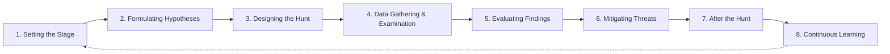

# Módulo 20 — Introduction to Threat Hunting & Hunting With Elastic

## Sección 2/6: The Threat Hunting Process

## 🔄 Las 8 etapas del proceso de Threat Hunting

### 1️⃣ Setting the Stage (Planificación y Preparación)

> [!NOTE]
> **Qué incluye**
> - Definir objetivos claros basados en el threat landscape, requisitos críticos del negocio, e insights de threat intelligence
> - Asegurar que el entorno esté listo: **logging extensivo** habilitado, herramientas (SIEM, EDR, IDS) correctamente configuradas
> - Mantenerse actualizado sobre amenazas recientes y perfiles de threat actors

> [!TIP]
> **Ejemplo práctico**
> Investigar reportes de threat intel, analizar vulnerabilidades específicas de la industria, estudiar TTPs de actores de amenaza. Identificar activos críticos probablemente objetivo. Configurar SIEM/EDR/IDS para correlacionar logs y generar alertas. Monitorear threat feeds y participar en comunidades de intercambio de información.

### 2️⃣ Formulating Hypotheses

> [!NOTE]
> **Qué son**
> Predicciones educadas que guían el hunt. Fuentes: threat intelligence reciente, actualizaciones de industria, alertas de herramientas de seguridad, o intuición profesional.

> [!WARNING]
> **Deben ser testeables**
> Una hipótesis debe ser **específica y verificable** — no una idea vaga.

> [!TIP]
> **Ejemplo de hipótesis bien formulada**
> *"Un grupo APT está aprovechando una vulnerabilidad conocida en el servidor web de la organización para establecer un canal C2."*
>
> (No: "puede que algo malo esté pasando" — eso no es testeable)

### 3️⃣ Designing the Hunt

> [!NOTE]
> **Qué incluye**
> - Identificar **fuentes de datos** específicas a analizar
> - Definir metodologías y herramientas a usar
> - Determinar IOCs o patrones específicos a buscar
> - Crear scripts/queries personalizados

> [!TIP]
> **Ejemplo práctico**
> Analizar logs de servidor web, tráfico de red, DNS, o telemetría de endpoints. Definir queries de búsqueda, filtros, reglas de correlación. Usar threat intel feeds/OSINT para identificar IOCs específicos del actor sospechado.

### 4️⃣ Data Gathering and Examination

> [!NOTE]
> **La fase activa del hunt**
> Recolectar datos (logs, tráfico de red, datos de endpoint) y analizarlos con las metodologías/herramientas predeterminadas. Objetivo: encontrar evidencia que **soporte o refute** la hipótesis inicial.

> [!WARNING]
> **Fase altamente iterativa**
> Puede requerir refinar la hipótesis o el enfoque de investigación conforme se descubre nueva información.

> [!TIP]
> **Ejemplo práctico**
> Examinar logs de acceso web para patrones de acceso inusuales, analizar capturas de tráfico para comunicaciones sospechosas con dominios externos, investigar logs de endpoint para comportamiento anómalo. Técnicas: análisis estadístico, análisis de comportamiento, detección basada en firmas. Herramientas: analizadores de logs, analizadores de paquetes, sandboxes de malware.

### 5️⃣ Evaluating Findings and Testing Hypotheses

> [!NOTE]
> **Interpretar resultados**
> Confirmar o refutar la hipótesis, entender el comportamiento de amenazas detectadas, identificar sistemas afectados, determinar impacto potencial.

> [!TIP]
> **Ejemplo práctico**
> Descubrir una serie de intentos de login fallidos desde una IP asociada a un actor conocido → confirma hipótesis de brute-force de credenciales. Encontrar conexiones salientes sospechosas a dominios maliciosos conocidos → soporta hipótesis de canal C2.

### 6️⃣ Mitigating Threats

> [!WARNING]
> **Si se confirma una amenaza**
> Acciones de remediación: aislar sistemas afectados, eliminar malware, parchear vulnerabilidades, modificar configuraciones. Objetivo: **erradicar** la amenaza y limitar el daño potencial.

> [!TIP]
> **Ejemplo práctico**
> Aislar de la red un sistema comprometido comunicándose con un C2. Desplegar herramientas de protección de endpoint para remover malware. Análisis forense para reunir evidencia adicional. Parchear vulnerabilidades identificadas. Ajustar configuraciones de red para restringir acceso no autorizado.

### 7️⃣ After the Hunt

> [!NOTE]
> **Documentar y compartir**
> Documentar hallazgos, métodos y resultados. Actualizar plataformas de threat intelligence, mejorar reglas de detección, refinar playbooks de IR, mejorar políticas de seguridad.

> [!TIP]
> **Ejemplo práctico**
> Actualizar plataformas de threat intel con nuevos IOCs descubiertos. Compartir información con otros equipos/partners externos. Mejorar reglas de detección basadas en patrones observados. Incorporar lecciones aprendidas en políticas y programas de entrenamiento.

### 8️⃣ Continuous Learning and Enhancement

> [!WARNING]
> **No es una tarea de una sola vez**
> Es un **proceso continuo** de aprendizaje y refinamiento. Cada ciclo de hunting debe alimentar el siguiente, permitiendo mejora continua de hipótesis, metodologías y herramientas conforme evoluciona el threat landscape.

> [!TIP]
> **Ejemplo práctico**
> Revisar la efectividad de hipótesis/metodologías/herramientas tras cada ciclo. Incorporar ML o behavioral analytics para detectar amenazas más sofisticadas. Participar en conferencias, entrenamientos, colaborar con otros equipos de hunting.

> [!NOTE]
> **Balance de arte y ciencia**
> Requiere destreza técnica, creatividad, y comprensión profunda tanto del entorno de la organización como del threat landscape más amplio. Los equipos más exitosos son los que **aprenden de cada hunt** y perfeccionan constantemente sus habilidades y procesos.

## 🦠 El proceso aplicado: Threat Hunting vs Emotet

> [!NOTE]
> **Caso práctico completo del módulo**
> Aplicación de las 8 etapas al malware **Emotet** — ejemplo end-to-end de cómo se ve el proceso en un escenario real.

| Etapa | Aplicación específica a Emotet |
|---|---|
| **Setting the Stage** | Investigar TTPs de Emotet (campañas previas, muestras de malware, reportes específicos). Entender vectores de infección: adjuntos/links maliciosos, explotación de vulnerabilidades. Identificar activos comúnmente objetivo (endpoints con privilegios admin, servidores de email) |
| **Formulating Hypotheses** | *"Emotet está usando cuentas de email comprometidas para enviar phishing con documentos Word maliciosos con macros"* |
| **Designing the Hunt** | Analizar logs de servidor de email, tráfico de red, logs de endpoint, muestras de malware en sandbox. Buscar IOCs específicos: subject lines, tipos de adjunto, patrones de comunicación de red asociados a Emotet, direcciones C2 conocidas, hashes de archivos |
| **Data Gathering & Examination** | Examinar logs de email para patrones de adjuntos sospechosos, analizar tráfico para comunicación con C2 conocidos de Emotet. Técnicas: análisis de headers de email, análisis de patrones de tráfico, análisis de comportamiento |
| **Evaluating Findings** | Confirmar: emails con subject lines/adjuntos similares a campañas de Emotet conocidas + conexiones a C2 confirmados de Emotet |
| **Mitigating Threats** | Aislar sistemas afectados, desplegar protección de endpoint para remover Emotet, analizar/remediar cuentas de email comprometidas, parchear vulnerabilidades explotadas, bloquear comunicación con C2/dominios maliciosos conocidos |
| **After the Hunt** | Documentar hallazgos, actualizar threat intel con nuevos IOCs de Emotet, compartir con otros equipos/partners, mejorar reglas de detección, refinar playbooks |
| **Continuous Learning** | Incorporar detección basada en comportamiento o ML específicamente diseñada para las TTPs evolutivas de Emotet |

## 🧠 Quiz de repaso

¿Está bien formular hipótesis que no son testeables? (True/False)

**False** — el módulo enfatiza explícitamente que las hipótesis deben ser **específicas y testeables** para guiar efectivamente dónde buscar y qué buscar. Una hipótesis no verificable no sirve para orientar el hunt.

## 🔗 Relacionado
- [Threat Hunting Fundamentals](01-threat-hunting-fundamentals.md)
- [Threat Hunting Glossary](03-threat-hunting-glossary.md)
- *Cyber Kill Chain (framework de referencia)*

#cjca #modulo20 #threat-hunting-process #hypothesis-driven #emotet #dfir #ioc
