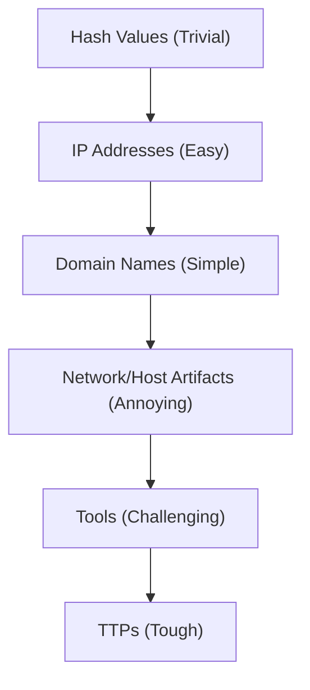
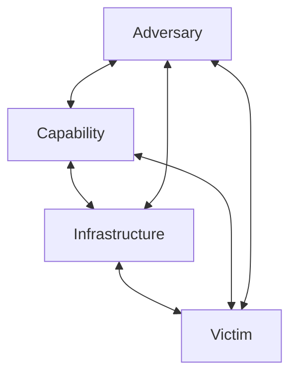

# Módulo 20 — Introduction to Threat Hunting & Hunting With Elastic

## Sección 3/6: Threat Hunting Glossary

## 📖 Términos fundamentales de CTI (Cyber Threat Intelligence)

### Adversary

> [!NOTE]
> **Definición**
> Entidad no autorizada que busca infiltrar tu organización para satisfacer sus "requisitos de recolección" — ganancia financiera, información interna, propiedad intelectual.

> [!TIP]
> **Categorías de adversarios**
> - Cyber criminals
> - Insider threats
> - Hacktivists
> - State-sponsored operators

### Advanced Persistent Threat (APT)

> [!NOTE]
> **Definición**
> Grupos altamente organizados o entidades nation-state con recursos extensos, capaces de operar durante **periodos prolongados**. Prefieren objetivos de alto valor (gobierno, salud, defensa).

> [!WARNING]
> **"Advanced" no significa necesariamente "técnicamente sofisticado"**
> - **Advanced** → refiere a la planificación estratégica sofisticada
> - **Persistent** → alude a su persistencia tenaz, respaldada por recursos sustanciales (financieros, mano de obra, tiempo)

### TTPs (Tactics, Techniques, Procedures)

> [!NOTE]
> **Término prestado del ámbito militar**
> Representan el patrón operativo o "firma" distintiva de un adversario.

| Nivel | Pregunta que responde | Descripción |
|---|---|---|
| **Tactics** | ¿Por qué? | Objetivos estratégicos, concepto de operaciones de alto nivel |
| **Techniques** | ¿Cómo? | Métodos específicos para lograr los objetivos tácticos (enfoque general, no paso a paso) |
| **Procedures** | ¿Con qué pasos exactos? | Instrucciones granulares, paso a paso — la "receta" |

> [!TIP]
> **Valor de analizar TTPs**
> Da insight profundo sobre cómo un adversario penetra la red, se mueve lateralmente, y logra sus objetivos → permite crear IOCs para detectar/frustrar ataques futuros.

### Indicator

> [!NOTE]
> **Fórmula clave**
> **Data + Context = Indicator**
>
> Datos técnicos aislados sin contexto relevante tienen **poco o ningún valor** para los defensores. El contexto permite entender la significancia del indicador para un análisis/respuesta efectivos.

### Threat

> [!NOTE]
> **Fórmula clave**
> **Capability + Intent + Opportunity = Threat**

| Componente | Descripción |
|---|---|
| **Intent** | Razón subyacente que motiva al adversario (espionaje corporativo, ganancia financiera, atacar relaciones de negocio) |
| **Capability** | Herramientas, recursos, respaldo financiero disponibles; nivel de habilidad técnica |
| **Opportunity** | Condiciones favorables para ejecutar la operación (credenciales/emails obtenidos, conocimiento de vulnerabilidades específicas) |

### Campaign

> [!NOTE]
> **Definición**
> Colección de incidentes que comparten TTPs similares y se cree que tienen requisitos de recolección comparables. Requiere tiempo y esfuerzo sustanciales para agregar y analizar.

### Indicators of Compromise (IOCs)

> [!NOTE]
> **Definición**
> Rastros digitales o artefactos derivados de intrusiones activas o pasadas — "señales de tránsito" de un adversario o actividad maliciosa específica.

> [!TIP]
> **Ejemplos de IOCs**
> Hashes de archivos maliciosos, IPs sospechosas, URLs, nombres de dominio, nombres de ejecutables/scripts maliciosos.

## 🔺 Pyramid of Pain (repaso ampliado)

> [!NOTE]
> **Origen**
> Concepto creado por **David Bianco** (FireEye) en su presentación *"Intel-Driven Detection and Response to Increase Your Adversary's Cost of Operations"*.

### Desglose nivel por nivel

| Nivel | Descripción | Por qué es fácil/difícil de cambiar |
|---|---|---|
| **Hash Values** | Huella digital de un archivo (MD5, SHA-1, SHA-256) | Cambiar **un solo byte** altera dramáticamente el hash → trivial de evadir |
| **IP Addresses** | Identificadores únicos de dispositivos en red | Fácil de ocultar/cambiar vía IP spoofing, VPNs, proxies, TOR |
| **Domain Names** | Identifican una o más IPs | Adversarios usan **DGAs** (Domain Generation Algorithms) o dynamic DNS para evadir detección rápidamente |
| **Network Artifacts** | Rastros en logs de red, packet captures, netflow, DNS requests (patrones de tráfico, headers únicos, uso inusual de protocolos) | Difícil de modificar sin afectar la efectividad/sigilo de la operación |
| **Host Artifacts** | Rastros en logs de sistema, filesystem, registry keys, procesos corriendo, DLLs cargadas, memoria volátil | También difícil de alterar sin afectar la campaña o revelar presencia |
| **Tools** | Software usado (malware, exploits, scripts, frameworks C2) | Adversarios sofisticados usan herramientas custom o modifican existentes para evadir |
| **TTPs** | Métodos específicos completos (Tactics + Techniques + Procedures) | **Máximo esfuerzo para cambiar** — requiere costo y esfuerzo significativos |

> [!TIP]
> **Ejemplo de TTP completo**
> - **Tactic**: acceso inicial vía spear-phishing
> - **Technique**: explotación de una vulnerabilidad específica de software
> - **Procedure**: los pasos exactos tomados para explotar esa vulnerabilidad

## 💎 Diamond Model of Intrusion Analysis

> [!NOTE]
> **Creadores**
> Sergio Caltagirone, Andrew Pendergast, y Christopher Betz. Framework conceptual para entender/analizar/responder a amenazas cibernéticas de forma estructurada.

### Los 4 vértices del diamante

| Vértice | Representa |
|---|---|
| **Adversary** | Individuo/grupo/organización responsable de la intrusión — sus capacidades, motivaciones, intención |
| **Capability** | TTPs usadas para llevar a cabo la intrusión (malware, exploits, herramientas maliciosas + métodos de despliegue) |
| **Infrastructure** | Recursos físicos/virtuales usados para facilitar la intrusión (servidores, dominios, IPs, recursos de red) |
| **Victim** | Objetivo de la intrusión — sus vulnerabilidades, valor de sus activos, exposición potencial |

> [!NOTE]
> **Meta-Features adicionales**
> Timestamp y Methodology complementan el modelo con contexto temporal y de enfoque.

> [!TIP]
> **Relaciones bidireccionales**
> Los 4 vértices están conectados por flechas bidireccionales — representan las **interacciones dinámicas** entre ellos. Ej: un adversario usa capacidades **a través de** infraestructura **para atacar a** una víctima.

### Ejemplo técnico ilustrativo

> [!NOTE]
> **Escenario: institución financiera atacada**
> - **Victim**: institución financiera
> - **Adversary**: grupo cibercriminal
> - **Capability**: emails de spear-phishing entregando un troyano bancario
> - **Infrastructure**: botnet usado para enviar los emails
>
> Al hacer clic en el link malicioso, el troyano se instala, permitiendo robo de datos financieros sensibles.

> [!TIP]
> **Valor práctico del análisis**
> Analizar la interacción entre componentes permite: fortalecer protocolos de seguridad de email, monitorear el troyano bancario específico, e implementar detección de actividad de red inusual asociada al botnet.

## ⚖️ Diamond Model vs Cyber Kill Chain

> [!NOTE]
> **Diferencia clave**
> - **Cyber Kill Chain**: enfocada en las **etapas** de un ataque (de reconocimiento a acciones sobre objetivos) — vista **secuencial/temporal**
> - **Diamond Model**: vista más **holística** de los componentes involucrados en la intrusión y sus **interrelaciones** — vista **relacional/estructural**

> [!TIP]
> **Son complementarios, no excluyentes**
> Ambos modelos son herramientas útiles en el arsenal de un profesional de ciberseguridad — cada uno ofrece una lente distinta para entender y responder a amenazas.

## 🔗 Relacionado
- [The Threat Hunting Process](02-the-threat-hunting-process.md)
- [Hunting For Stuxbot](05-hunting-for-stuxbot.md)
- *Cyber Kill Chain y Pyramid of Pain (framework de referencia)*

#cjca #modulo20 #threat-hunting-glossary #pyramid-of-pain #diamond-model #ttps #apt #ioc #cti
