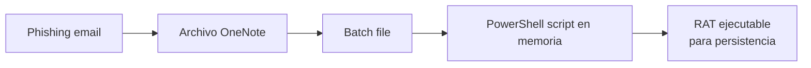
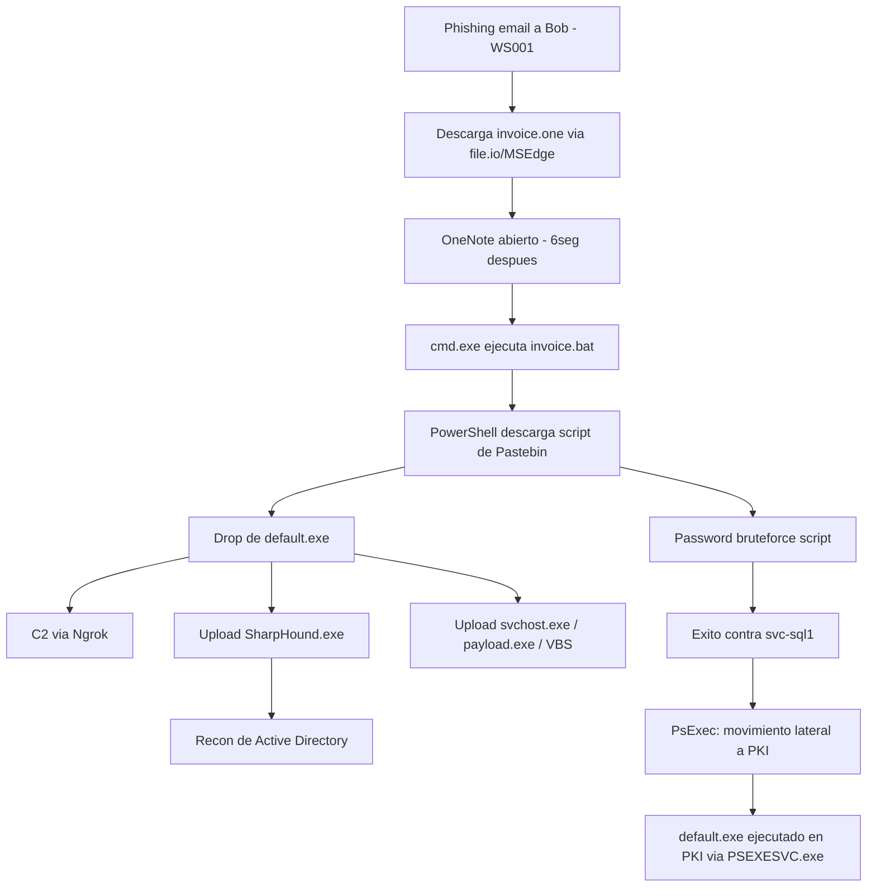

# Módulo 20 — Introduction to Threat Hunting & Hunting With Elastic

## Sección 5/6: Hunting For Stuxbot

> [!WARNING]
> **Nota sobre la Sección 4**
> La Sección 4 de este módulo quedó pendiente de documentar. Se agregará cuando esté disponible el contenido.

## 📄 Threat Intelligence Report: Stuxbot

> [!NOTE]
> **Perfil del grupo**
> Colectivo de cibercrimen organizado **"Stuxbot"**. Campañas de phishing oportunistas iniciadas este año, **sin targeting específico** ("anyone, anytime"). Motivación principal: **espionaje** (no hay evidencia de exfiltración de blueprints/info propietaria, ni de ransomware/extorsión).

| Campo | Detalle |
|---|---|
| **Plataformas objetivo** | Microsoft Windows |
| **Entidades amenazadas** | Usuarios de Windows |
| **Impacto potencial** | Takeover completo del equipo / escalada de dominio |
| **Nivel de riesgo** | Crítico |

> [!NOTE]
> **Vector de acceso inicial**
> Phishing oportunista aprovechando datos de redes sociales, brechas pasadas (bases de emails), sitios corporativos. Poca evidencia de spear-phishing dirigido.

## 🔗 Secuencia del ataque (cadena completa)



### Detalles por etapa

> [!NOTE]
> **Initial Breach**
> Email de phishing rudimentario disfrazado de factura ("Invoice #76"). Link → archivo **OneNote** alojado en servicios de file hosting (Mega.io, etc.). El OneNote simula ser una factura con un botón "HIDDEN" que dispara un **batch file embebido**, el cual descarga scripts de PowerShell (stage 0 del payload).

> [!WARNING]
> **RAT Characteristics**
> RAT **modular** — capacidades ampliables. Funciones observadas: capturas de pantalla, ejecución de **Mimikatz**, shell CMD interactiva.

> [!NOTE]
> **Persistence**
> Todos los mecanismos de persistencia observados hasta ahora involucran un **archivo EXE depositado en disco**.

> [!WARNING]
> **Lateral Movement**
> Dos métodos identificados:
> - **PsExec** original firmado por Microsoft
> - **WinRM**

### IOCs conocidos (del reporte)

```
OneNote File:
https://transfer.sh/get/kNxU7/invoice.one
https://mega.io/dl9o1Dz/invoice.one

Staging (PowerShell Script):
https://pastebin.com/raw/AvHtdKb2
https://pastebin.com/raw/gj58DKz

C2 Nodes:
91.90.213.14:443
103.248.70.64:443
141.98.6.59:443

SHA256:
226A723FFB4A91D9950A8B266167C5B354AB0DB1DC225578494917FE53867EF2
C346077DAD0342592DB753FE2AB36D2F9F1C76E55CF8556FE5CDA92897E99C7E
018D37CBD3878258C29DB3BC3F2988B6AE688843801B9ABC28E6151141AB66D4
```

## 🖥️ Configuración del entorno de hunting

```
1. http://[Target IP]:5601 -> Discover
2. Calendario -> "last 15 years" -> Apply
3. Timezone: Europe/Copenhagen
   (http://[Target IP]:5601/app/management/kibana/settings)
```

> [!NOTE]
> **Fuentes de datos disponibles**
> - **Windows audit logs** (`windows*`)
> - **Sysmon logs** (`windows*`)
> - **PowerShell logs** (`windows*`)
> - **Zeek logs** — network security monitoring (`zeek*`)

> [!TIP]
> **Contexto del entorno**
> Organización pequeña (~200 empleados, marketing online). Gmail vía navegador, Microsoft Edge por defecto, TeamViewer para soporte remoto, GPOs de AD para gestión.

## 🔍 La Hunt — Metodología paso a paso

> [!NOTE]
> **Hipótesis de partida**
> Éxito de un phishing email entregando un archivo OneNote malicioso.

### Paso 1: Buscar descarga del archivo (Sysmon Event ID 15 — FileCreateStreamHash)

```
event.code:15 AND file.name:*invoice.one
```
> [!TIP]
> **Qué revela**
> Confirma descarga vía **MSEdge**, guardado en Downloads del empleado **Bob**. Timestamp: `March 26, 2023 @ 22:05:47`.

### Paso 2: Corroborar con Sysmon Event ID 11 (File create)

```
event.code:11 AND file.name:invoice.one*
```
> [!TIP]
> **Por qué el asterisco al final**
> El nombre incluye un **Zone Identifier** adicional (indica origen desde internet). Método efectivo incluso cuando el navegador no está directamente involucrado.

> [!NOTE]
> **Datos extraídos**
> Hostname: `WS001` — IP: `192.168.28.130` (confirmado con Sysmon Event ID 3 filtrando por hostname).

### Paso 3: Investigar con Zeek (cuando Sysmon no captura conexiones de red del browser)

> [!WARNING]
> **Por qué Zeek es clave aquí**
> Es común **no capturar** conexiones de red generadas por navegadores en Sysmon (evita volumen excesivo de logs). Zeek llena ese vacío.

```
source.ip:192.168.28.130 AND dns.question.name:*
```
(rango horario: 22:05:00 – 22:05:48)

> [!TIP]
> **Filtrar ruido común**
> Revisar los valores más frecuentes del campo (`dns.question.name`) y excluir dominios conocidos no relacionados (google.com, google-analytics.com, etc.)

> [!NOTE]
> **Hallazgo**
> Secuencia: acceso a Gmail → interacción con **file.io** (hosting) → Microsoft Defender SmartScreen escanea el archivo descargado (comportamiento típico tras descarga vía Edge).

### Paso 4: Resolver IPs de file.io y buscar conexiones

```
IPs resueltas: 34.197.10.85, 3.213.216.16
```
> [!TIP]
> **Confirmación**
> Conexión de `192.168.28.130` hacia `34.197.10.85:443` en el mismo timeframe → confirma que Bob descargó "invoice.one" desde file.io.

### Paso 5: ¿Se abrió el archivo? (Sysmon Event ID 1 — Process Creation)

```
event.code:1 AND process.command_line:*invoice.one*
```
> [!NOTE]
> **Hallazgo**
> El archivo fue abierto **~6 segundos** después de la descarga — timestamp `22:05:53.601`.

### Paso 6: ¿Qué generó OneNote.exe como proceso hijo?

```
event.code:1 AND process.parent.name:"ONENOTE.EXE"
```
> [!WARNING]
> **Hallazgo clave**
> `cmd.exe` ejecutando `invoice.bat` desde una ubicación temporal (adjunto embebido en el OneNote).

### Paso 7: ¿El batch spawneó algo más?

```
event.code:1 AND process.parent.command_line:*invoice.bat*
```
> [!WARNING]
> **Resultado**
> Ejecución de **PowerShell** con argumentos que descargan/ejecutan contenido desde **Pastebin** — coincide con lo descrito en el reporte de threat intel.

### Paso 8: Rastrear toda la actividad de ese proceso PowerShell (por PID)

```
process.pid:"9944" and process.name:"powershell.exe"
```
> [!TIP]
> **Columnas útiles a agregar**
> `file.path`, `dns.question.name`, `destination.ip`

> [!NOTE]
> **Hallazgos relevantes**
> - Consultas DNS a **Ngrok** (probable C2 — enmascara tráfico malicioso tras un dominio conocido/legítimo)
> - Conexiones cifradas (puerto 443)
> - Drop de un EXE (probable persistencia)
> - Query DNS + conexión hacia `DC1` (Domain Controller)

> [!TIP]
> **Indicio de interacción humana**
> Lapsos de tiempo entre actividades sugieren interacción manual del atacante, no un script totalmente automatizado (salvo que hubiera sleeps aleatorios).

### Paso 9: Investigar el cambio de IP de C2 (persistencia del canal)

> [!NOTE]
> **Zeek: conexiones a la IP descubierta**
> La actividad continuó al día siguiente — posible rotación de IP de C2 (dynamic DNS de Ngrok). Verificado revisando cambios en `dns.answers.data` para consultas a `ngrok.io`.

### Paso 10: ¿Se ejecutó el EXE dropeado ("default.exe")?

```
process.name:"default.exe"
```
> [!WARNING]
> **Hallazgos importantes**
> - Genera queries DNS a Ngrok + conexiones al C2
> - Sube (upload) **`SharpHound.exe`** (herramienta de recon de Active Directory — mapea attack paths de escalada) y **`svchost.exe`** (probable segundo agente malicioso disfrazado de proceso legítimo)
> - Más arriba en el log: también sube `payload.exe` y un archivo VBS

### Paso 11: ¿Se ejecutó SharpHound?

```
process.name:"SharpHound.exe"
```
> [!NOTE]
> **Resultado**
> Ejecutado **dos veces**, con ~2 minutos de diferencia entre ejecuciones — con argumento de método de recolección "all".

### Paso 12: Buscar el mismo hash en otros hosts del entorno

```
process.hash.sha256:018d37cbd3878258c29db3bc3f2988b6ae688843801b9abc28e6151141ab66d4
```
> [!WARNING]
> **Hallazgo crítico**
> El mismo archivo aparece en **`WS001` y `PKI`** — confirma que el servidor **PKI también fue comprometido**. Además, se encuentra un backdoor bajo el perfil de **`svc-sql1`** → esta cuenta de servicio está comprometida.

### Paso 13: ¿Cómo llegó el atacante a PKI?

> [!NOTE]
> **Parent process en PKI**
> `default.exe` fue ejecutado con **`PSEXESVC.exe`** como padre — confirma **movimiento lateral vía PsExec**, tal como anticipaba el reporte de threat intel.

### Paso 14: ¿Cómo se comprometió la contraseña de svc-sql1?

```
(event.code:4624 OR event.code:4625) AND winlog.event_data.LogonType:3 AND source.ip:192.168.28.130
```
> [!TIP]
> **Hipótesis validada**
> Se detectan **2 intentos fallidos** contra la cuenta `administrator` (cerca del momento de la actividad sospechosa inicial), seguidos de **múltiples logons exitosos** de `svc-sql1` — dos días después. Esto es consistente con el script de **password bruteforcing** subido anteriormente por el atacante: fallaron contra `administrator`, tuvieron éxito contra `svc-sql1`.

## 🧩 Reconstrucción completa de la cadena de ataque



> [!TIP]
> **Punto de decisión metodológico**
> El módulo señala explícitamente dos caminos posibles tras confirmar la descarga: **(a)** cruzar datos con el reporte de threat intel, o **(b)** conducir una investigación estilo IR rastreando la secuencia completa post-descarga. Se elige la opción (b) — es el enfoque más completo para entender el alcance real del compromiso.

## 🖥️ Ejercicio práctico

> [!WARNING]
> **Tiempo de espera**
> Esperar 3-5 minutos tras spawnear el target para que Kibana esté disponible.

> [!NOTE]
> **Preguntas del lab (requieren el entorno real)**
> 1. Nombre completo del archivo VBS subido por `default.exe` (con extensión)
> 2. Argumentos del proceso pasados a `.\mimikatz.exe`
> 3. Herramienta de hacking popular de la cual deriva el código PowerShell que escanea shares de red (formato: `P____V___`)

> [!WARNING]
> No se incluyen las respuestas exactas — requieren examinar el dataset real del spawn siguiendo exactamente la misma metodología de queries documentada arriba (buscar por `process.parent.name:"default.exe"` para el VBS, filtrar por `process.name:"mimikatz.exe"` para los argumentos, y revisar los logs de PowerShell Script Block Logging para identificar la herramienta de origen del código de escaneo de shares).

## 🧠 Cheatsheet de queries usadas en este hunt

```
# Descarga de archivo via browser
event.code:15 AND file.name:*archivo*

# Creacion de archivo (con Zone Identifier)
event.code:11 AND file.name:archivo*

# Conexion de red (Sysmon)
event.code:3 AND host.hostname:HOSTNAME

# DNS queries (Zeek)
source.ip:IP AND dns.question.name:*

# Apertura/ejecucion de un archivo
event.code:1 AND process.command_line:*archivo*

# Procesos hijos de una aplicacion especifica
event.code:1 AND process.parent.name:"APP.EXE"

# Procesos hijos de un script especifico
event.code:1 AND process.parent.command_line:*script.bat*

# Todas las actividades de un proceso por PID
process.pid:"PID" and process.name:"proceso.exe"

# Buscar ejecucion de un binario especifico en toda la red
process.name:"binario.exe"

# Buscar el mismo hash en todo el entorno
process.hash.sha256:HASH

# Logons exitosos/fallidos desde un origen especifico
(event.code:4624 OR event.code:4625) AND winlog.event_data.LogonType:3 AND source.ip:IP
```

## 🔗 Relacionado
- [Threat Hunting Glossary](03-threat-hunting-glossary.md)
- [Skills Assessment: Hunting For Stuxbot Round 2](06-skills-assessment-stuxbot-round-2.md)
- [Modulo 19 - SIEM Fundamentals](../04-security-monitoring-siem/01-siem-definition-fundamentals.md)

#cjca #modulo20 #threat-hunting #stuxbot #elastic-stack #sysmon #zeek #kql #lateral-movement #c2 #sharphound
